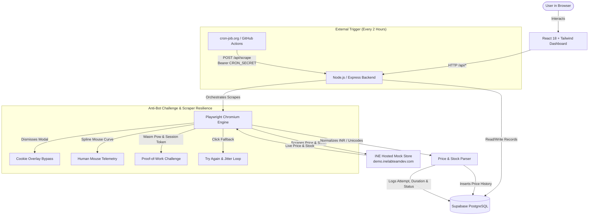

# INE Product Price Tracker

> A production-grade, full-stack automated price and stock tracking system for the INE mock store ([demo.inelabteamdev.com](https://demo.inelabteamdev.com/)), featuring resilient Playwright Chromium scraping, PostgreSQL persistence via Supabase, interactive Recharts analytics, and an external 2-hour cron trigger architecture designed for serverless/PaaS deployment.

---

## Architecture Overview



---

## Key Features

- **Live Store Catalog Search**: Instant debounce search querying live mock store products with category filtering, quick chips, and duplicate tracking prevention.
- **Resilient Playwright Automation Engine**:
  - Automatically overcomes intentional store obstacles (flaky click handlers in `Xn`, delayed `.cookie-overlay` modals, and transient `challenge_failed` errors).
  - Emulates human mouse trajectory using cubic Bézier curves and dwell times to solve client-side telemetry requirements.
  - Cleans zero-width spaces (`\u200B`), non-breaking spaces, currency symbols, and full-width Unicode characters with robust parsing.
- **Headed Demonstration Mode (`npm run scrape:headed`)**:
  - Launches a visible Chromium window with `slowMo: 180` and step-by-step console logs specifically designed for assignment video recording.
- **Observable Scrape History & Auditing**:
  - Every scrape run records status (`SUCCESS`, `RETRIED`, `FAILED`), attempt number, execution duration in milliseconds, and error traces in `scrape_logs`.
- **Interactive Price History Visualizations**:
  - Sleek Recharts area chart with color gradients, Min/Max reference lines, and responsive stock tooltips.
  - Price trends and historical records table with exact timestamps.
- **Production-Ready 2-Hour Scheduled Architecture**:
  - Avoids flawed in-memory `setInterval()` that fails when free-tier hosts (e.g., Render) go to sleep.
  - Implements a secured webhook endpoint `POST /api/scrape` with `CRON_SECRET` for integration with external cron services (e.g. cron-job.org).
- **Graceful In-Memory Fallback**:
  - Automatically falls back to an in-memory database if Supabase credentials are not provided, allowing zero-config instant local testing.

---

## Tech Stack

| Layer | Technology |
| :--- | :--- |
| **Frontend** | React 18, Vite, Tailwind CSS, Recharts, Lucide Icons |
| **Backend** | Node.js, Express.js, CORS, dotenv |
| **Automation** | Playwright (Chromium) with custom spline cursor emulation |
| **Database** | Supabase (PostgreSQL) with cascading foreign keys & indexes |
| **Deployment** | Render / Railway (Backend), Vercel (Frontend), cron-job.org (Scheduler) |

---

## Quick Start (Local Setup)

### 1. Prerequisites
- **Node.js**: v18.0.0 or later
- **npm**: v9.0.0 or later

### 2. Clone and Install Dependencies

```bash
# Clone the repository
git clone <your-repo-url>
cd INE

# Install root dependencies
npm install

# Install backend dependencies
cd backend && npm install

# Install Playwright Chromium browser binaries
npx playwright install chromium

# Install frontend dependencies
cd ../frontend && npm install
cd ..
```

### 3. Environment Variables Configuration

Create a `.env` file inside the `backend/` directory:

```bash
cp .env.example backend/.env
```

Edit `backend/.env` with your Supabase credentials:

```env
PORT=5000
NODE_ENV=development

# Target Mock Store
MOCK_STORE_URL=https://demo.inelabteamdev.com

# Supabase Configuration
SUPABASE_URL=https://your-project.supabase.co
SUPABASE_SECRET_KEY=your-supabase-service-role-secret-key

# Cron Job Secret for 2-hour external scheduler
CRON_SECRET=ine_super_secret_cron_token_2026
```

> **Note**: If you run without Supabase credentials, the server will automatically use its built-in in-memory fallback store so you can evaluate the entire application immediately!

### 4. Database Setup (Supabase)

1. Go to your [Supabase Dashboard](https://app.supabase.com/) and open the **SQL Editor**.
2. Open [migrations/001_initial_schema.sql](file:///migrations/001_initial_schema.sql) in this repository.
3. Paste and run the SQL script. This creates:
   - `tracked_products` (stores product metadata, URLs, and active toggle state)
   - `price_history` (stores timestamped price & stock records)
   - `scrape_logs` (stores observable attempt history, statuses, and execution latencies)

---

## Running the Application

### Start the Backend (API Server)
```bash
# From root
npm run dev:backend
# Or from backend/
cd backend && npm run dev
```
The API server runs on [http://localhost:5000](http://localhost:5000).

### Start the Frontend (Vite React Dashboard)
```bash
# From root
npm run dev:frontend
# Or from frontend/
cd frontend && npm run dev
```
Open [http://localhost:3000](http://localhost:3000) in your browser.

---

## Scraper Verification & Video Recording

### 1. Headed Mode (for Assignment Video Demonstration)
To open a visible Chromium browser that demonstrates navigating to the mock store, bypassing the cookie overlay, emulating mouse movements, revealing the price, and recording the result:

```bash
npm run scrape:headed
```

### 2. Automated Headless Scraper Test
To verify the Playwright challenge resolution headlessly with timing diagnostics:

```bash
npm run test:scraper
```

---

## 2-Hour Scheduled Architecture (Production Setup)

### Why Not `setInterval()` in Code?
Free-tier cloud hosts like **Render** spin down dynos/containers after 15 minutes of inactivity. When the container sleeps, all internal `setInterval()` and `node-cron` timers are frozen. Additionally, if the service scales to multiple containers, in-process timers trigger duplicate scrapes.

### Production Solution: External Cron Webhook

The backend exposes:
```http
POST /api/scrape
Authorization: Bearer <CRON_SECRET>
```

#### Setting up with cron-job.org (Free):
1. Sign up for a free account at [cron-job.org](https://cron-job.org/).
2. Click **Create Cronjob**.
3. **Title**: `INE Price Tracker 2-Hour Scrape`.
4. **URL**: `https://<your-backend-app>.onrender.com/api/scrape`
5. **Schedule**: Set interval to **Every 2 hours** (cron expression: `0 */2 * * *`).
6. **Request Method**: `POST`.
7. **HTTP Headers**: Add header:
   - Key: `Authorization`
   - Value: `Bearer <YOUR_CRON_SECRET>`
8. Click **Save**.

Now, every 2 hours, cron-job.org sends an authenticated request that wakes your Render service, triggers the Playwright scraper for all active products, logs the results to PostgreSQL, and allows the container to return to idle.

---

## Production Deployment Guide

### Deploying Backend to Render
1. Push your repository to GitHub.
2. In Render, create a **New Web Service** connected to your repo.
3. **Root Directory**: `backend`
4. **Build Command**: `npm install && npx playwright install chromium --with-deps`
5. **Start Command**: `npm start`
6. Add Environment Variables:
   - `NODE_ENV`: `production`
   - `PORT`: `5000`
   - `MOCK_STORE_URL`: `https://demo.inelabteamdev.com`
   - `SUPABASE_URL`: `https://<project-ref>.supabase.co`
   - `SUPABASE_SECRET_KEY`: `<service-role-key>`
   - `CRON_SECRET`: `<your-cron-secret>`

### Deploying Frontend to Vercel
1. In Vercel, import the GitHub repository.
2. **Root Directory**: `frontend`
3. **Framework Preset**: `Vite`
4. **Build Command**: `npm run build`
5. **Output Directory**: `dist`
6. Under Environment Variables:
   - `VITE_API_URL`: `https://<your-render-backend-url>.onrender.com`

---

## Reverse Engineering Insights & AI Tools

For in-depth analysis of:
- The mock store's WebAssembly proof-of-work challenge and mouse telemetry requirements,
- Flaky click handling and cookie modal obstacles,
- Why plain HTTP parsing is impossible on the mock store, and
- **AI Tools and Corrections** (documenting AI mistakes, hallucinations, and human engineering fixes),

👉 **See the dedicated [DESIGN_NOTES.md](file:///DESIGN_NOTES.md)**.

---

## License

MIT License. Developed for the Software Engineer Intern Assignment.
